# 🛰️ Tarefa 05 – Transmissão de Dados via LoRa

**Aluno:** Alan Huss da Silva Lopes  
**Programa:** EmbarcaTech – Trilha FPGA  
**Instituição:** IFRN / Polo Currais Novos  
**Data de Entrega:** 02/11/2025  
**Plataforma:** ColorLight i9 + BitDogLab  
**Repositório:** [github.com/Alan-Huss/Cores-I2c-UART-e-SPI-no-litex-](https://github.com/Alan-Huss/Cores-I2c-UART-e-SPI-no-litex-)

---

## 🎯 1. Objetivo

O objetivo desta tarefa é desenvolver um **sistema de comunicação sem fio** utilizando **módulos LoRa RFM96**, interligando:

- Um **SoC customizado** em FPGA (ColorLight i9) rodando um **core VexRiscv**;  
- Um **sensor AHT10 (I2C)** para coleta de temperatura e umidade;  
- Um **nó receptor BitDogLab**, que exibe as leituras em um **display OLED**.

---

## 🧩 2. Arquitetura Geral

O projeto utiliza o **LiteX** como framework de integração do hardware, com periféricos SPI, I2C e UART integrados ao barramento CSR do VexRiscv.

```mermaid
graph TD
    AHT10["🌡️ Sensor AHT10<br>(I2C)"] -->|Temperatura / Umidade| FPGA["🧠 SoC FPGA<br>ColorLight i9 (LiteX + VexRiscv)"]
    FPGA -->|SPI| LoRaTX["📡 Módulo LoRa RFM96<br>(Transmissor)"]
    LoRaTX -->|Rádio 915 MHz| LoRaRX["📡 Módulo LoRa RFM96<br>(Receptor)"]
    LoRaRX --> BitDog["🐶 BitDogLab<br>MCU + OLED Display"]
```


## 🧱 3. Estrutura do Repositório

``` bash
Cores-I2c-UART-e-SPI-no-litex-
├── litex/
│   ├── colorlight_i5.py        # SoC LiteX customizado com SPI/I2C
│   ├── build/                  # Bitstream gerado (após compilação)
│   └── gateware/               # Arquivos intermediários do LiteX
│
├── firmware/
│   ├── main.c                  # Firmware principal (bare-metal)
│   ├── aht10.c / aht10.h       # Driver I2C para sensor AHT10
│   ├── lora_RFM95.c / .h       # Driver SPI para módulo LoRa
│   ├── Makefile                # Script de compilação (OSS CAD Suite)
│   └── include/                # Cabeçalhos auxiliares
│
└── README.md                   # Documentação (este arquivo)
```

## ⚙️ 4. SoC – Configuração e Periféricos

O arquivo `colorlight_i5.py` implementa um **SoC customizado LiteX** com os seguintes elementos:

- **Core:** `VexRiscv`
- **Clock:** 60 MHz (PLL a partir do clock externo de 25 MHz)
- **Periféricos:**
  - `SPI` — comunicação com o módulo **LoRa RFM96**
  - `I2C` — leitura do **sensor AHT10**
  - `UART` — terminal de depuração via `litex_term`
  - `GPIOOut` — controle do **reset do LoRa**
  - `Timer` e `LEDs` — indicadores de status e depuração

### 🧠 Mapa de Pinos


| Periférico | Função | Pino FPGA | Conector | Descrição |
|-------------|---------|-----------|-----------|------------|
| **SPI CLK** | LoRa SCK | G20 | P2 - CN2 | Clock SPI |
| **SPI MOSI** | LoRa MOSI | L18 | P2 - CN2 | Dados enviados da FPGA para o LoRa |
| **SPI MISO** | LoRa MISO | M18 | P2 - CN2 | Dados recebidos do LoRa para a FPGA |
| **SPI CS** | LoRa CS_N | N17 | P2 - CN2 | Seleção de chip (Chip Select) |
| **GPIO** | LoRa RESET | L20 | P2 - CN2 | Controle de reset do módulo LoRa |
| **I2C SDA** | AHT10 SDA | U18 | P2 - J2 | Linha de dados bidirecional (Data) |
| **I2C SCL** | AHT10 SCL | U17 | P2 - J2 | Linha de clock do barramento I2C |


### 🔌 Ligação dos periféricos

<p align="center">
  <br>
  <strong>Figura 1 – Ligação da placa BitDogLab</strong>
</p>

</br>

<p align="center">
  <br>
  <strong>Figura 2 – Ligação dos periféricos na FPGA</strong>
</p>

---


## 💾 5. Firmware – FPGA (Transmissor)

O firmware bare-metal (`main.c`) roda sobre o processador **VexRiscv** e executa:

1. Inicialização dos periféricos SPI e I2C.  
2. Leitura de temperatura e umidade do sensor **AHT10**.  
3. Transmissão periódica dos dados via módulo **LoRa RFM95**.  
4. Espera de 10 s entre cada envio.

### 🧮 Estrutura do Pacote Transmitido

| Campo | Tipo | Descrição |
|--------|------|-----------|
| `temperatura` | `float` | Valor em graus Celsius |
| `umidade` | `float` | Valor em porcentagem (%) |
| `estado` | `uint8_t` | Indica leitura/transmissão válida |

### 🧠 Loop Principal Simplificado

```c
while (1) {
    aht10_read(&temperatura, &umidade);
    dados_t pacote = {temperatura, umidade, 1};
    lora_send_struct(&pacote);
    msleep(10000);  // Espera 10 segundos
}
```

## 🖥️ 6. Firmware – BitDogLab (Receptor)

O firmware da **BitDogLab** atua como o **nó receptor** do sistema LoRa.  
Suas principais funções são:

- Inicializar o módulo **LoRa RFM96** via SPI.  
- Receber os pacotes transmitidos pela FPGA (ColorLight i9).  
- Exibir os valores de **temperatura** e **umidade** em um **display OLED** conectado via I2C.  
- Atualizar automaticamente a cada nova transmissão recebida.  

O firmware foi desenvolvido em **C++**, utilizando a biblioteca LoRa correspondente ao módulo **RFM96**.

### 💡 Exemplo de Exibição (pseudo-código)

```cpp
if (lora.receive(pacote)) {
    oled.clear();
    oled.setCursor(0, 0);
    oled.printf("Temperatura: %.2f °C\n", pacote.temp);
    oled.printf("Umidade: %.2f %%\n", pacote.umid);
}
```

## 🧰 7. Compilação e Execução
### 🧱 1️⃣ – Gerar e Carregar o SoC LiteX

Na raiz do repositório, execute o comando abaixo para gerar e carregar o SoC na FPGA:

```bash
python3 litex/colorlight_i5.py --board i9 --revision 7.2 --cpu-type=vexriscv --build --load --ecppack-compress
```
💡 Este comando cria o bitstream, gera os arquivos do SoC e carrega automaticamente na FPGA ColorLight i9 via cabo USB-ECPDAP.

## 💾 2️⃣ – Compilar o Firmware Bare-Metal

Entre na pasta firmware/ e execute:
``` bash
cd firmware/
make clean && make
```
Isso gera o arquivo binário main.bin, compatível com o processador VexRiscv do SoC LiteX.

## 🚀 3️⃣ – Carregar o Firmware no SoC

Após a compilação, envie o firmware para o processador RISC-V da FPGA.
Substitua /dev/ttyACM`xx` pela porta serial correspondente à FPGA detectada no seu sistema:

``` bash
litex_term --kernel main.bin /dev/ttyACMxx
reboot
```

🔁 O comando reboot reinicia o processador e executa automaticamente o firmware, iniciando a leitura do sensor AHT10 e o envio dos dados via LoRa.

## 🎥 8. Demonstração em Vídeo


[](https://youtube.com/shorts/TCkurdMFAII?feature=share)


## 💡 9. Nota de Hardware: Clarificação do Módulo LoRa (RFM95 vs. RF96)

É importante notar uma discrepância encontrada no hardware LoRa utilizado, que é comum nestes módulos:

* **Marcação vs. Funcionalidade:** Embora o chip de silício (o *die*) esteja estampado com a marcação **RF96** (frequentemente associada à frequência de 433MHz), o módulo completo em uso é, de fato, o **RFM95**, configurado para operar em **915 MHz**.
* **Frequência de Operação:** A frequência de **915 MHz** foi utilizada. Ela é funcional no módulo RFM95 e foi preferida em detrimento da 433MHz, que pode apresentar um alcance de transmissão inferior.
* **Compatibilidade:** O driver de firmware (`lora_RFM95.c`) é, portanto, o correto, correspondendo ao módulo **RFM95 a 915MHz** em uso.

Abaixo estão as imagens do componente utilizado, mostrando a marcação no chip e descrição do módulo na parte traseira:

<p align="center">
  
  
</p>

<p align="center"><strong>Figura 3: Detalhe do chip (RF96) no módulo RFM95 (915 MHz).</strong></p>


## 📊 10. Resultados

- Comunicação **LoRa** estável e confiável entre a FPGA (ColorLight i9) e a BitDogLab.  
- Integração completa dos barramentos **SPI** (LoRa RFM96) e **I2C** (AHT10) dentro do SoC LiteX.  
- Operação autônoma do sistema após inicialização, sem necessidade de intervenção manual.  
- Transmissões periódicas a cada 10 segundos, com leitura consistente de temperatura e umidade.  
- Firmware e SoC configurados com sucesso utilizando o **core VexRiscv** e periféricos LiteX.  


## 🧾 11. Conclusão

O projeto **Tarefa 05 – Transmissão de Dados via LoRa** demonstrou de forma prática a integração entre hardware e software em sistemas embarcados.  
Foram desenvolvidos e validados todos os elementos de um **System-on-Chip (SoC)** funcional com comunicação sem fio.

### 🔧 Principais Conquistas

- Criação de um **SoC customizado** no framework **LiteX**, rodando o core **VexRiscv**.  
- Implementação de drivers dedicados para os periféricos **I2C (AHT10)** e **SPI (LoRa RFM96)**.  
- Comunicação LoRa funcional entre FPGA e microcontrolador externo (**BitDogLab**).  
- Transmissão periódica e estável de dados ambientais (temperatura e umidade).  
- Estrutura de projeto organizada, modular e replicável para outras aplicações de **IoT**.  

O trabalho evidencia o domínio dos conceitos de **arquitetura de SoCs embarcados**, **comunicação de periféricos** e **integração firmware-hardware** no contexto da residência **EmbarcaTech**.


## 🔗 12. Referências

- [Repositório de exemplos com a Colorlight i9 – GitHub](https://github.com/dvcirilo/colorlight-i9-examples)  
- [LiteX Framework Documentation](https://github.com/enjoy-digital/litex/wiki)  
- [LoRa RFM95 Datasheet – HopeRF](https://cdn.sparkfun.com/assets/learn_tutorials/8/0/2/RFM95_96_97_98W.pdf)  
- [AHT10 Datasheet – Aosong](https://github.com/adafruit/Adafruit_AHTX0)  
- [Colorlight-FPGA-Projects](https://github.com/wuxx/Colorlight-FPGA-Projects?utm_source=chatgpt.com)  
- [EmbarcaTech – Trilha FPGA (IFRN)](https://ava.ifrn.edu.br/)
